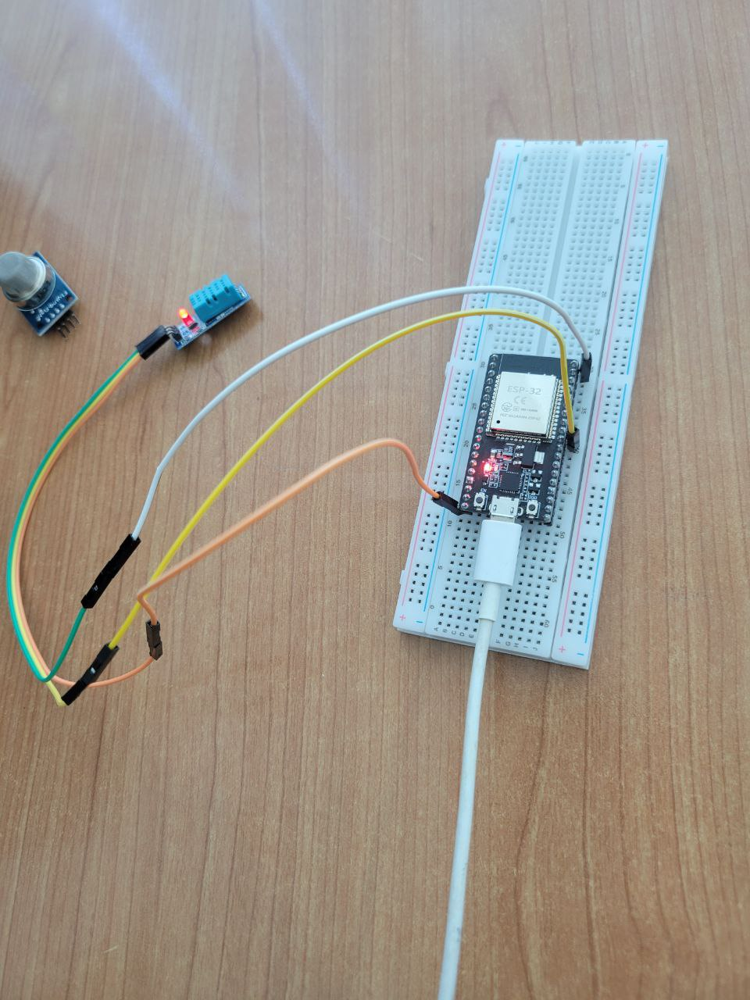
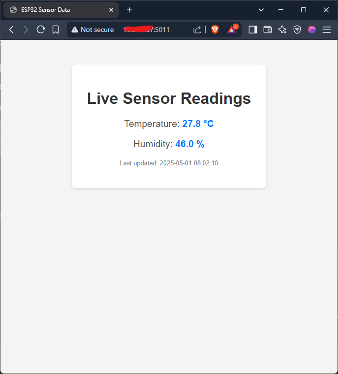

# Temperature & Humidity Monitoring System

A complete IoT system for monitoring temperature and humidity using an ESP32 microcontroller with a DHT11 sensor and a Flask web server.



## Project Overview

This project creates a real-time temperature and humidity monitoring system with the following components:

- **Hardware**: ESP32 microcontroller with DHT11 temperature/humidity sensor
- **Firmware**: Arduino sketch to collect sensor data and send it to a server
- **Backend**: Flask server to receive, process, and display the sensor data
- **Frontend**: Simple web interface that auto-refreshes to show the latest readings

## Hardware Requirements

- ESP32 microcontroller board
- DHT11 temperature and humidity sensor
- Breadboard and jumper wires for connections
- USB cable for programming/powering the ESP32

## Hardware Setup

1. Connect the DHT11 sensor to the ESP32:
   - VCC pin to 3.3V on ESP32
   - GND pin to GND on ESP32
   - DATA pin to GPIO 4 on ESP32 (as configured in the code)

## Software Setup

### ESP32 Firmware

1. Open the Arduino sketch (`sketch_may1a.ino`) in the Arduino IDE
2. Install the required libraries:
   - WiFi
   - HTTPClient
   - DHT
   - ArduinoJson
3. Configure the WiFi and server settings:
   ```cpp
   const char* ssid = "your_network_name";
   const char* password = "your_network_password";
   const char* serverIP = "server_IP";
   const int serverPort = 5000; // Set to match your Flask server port
   ```
4. Upload the sketch to your ESP32

### Flask Server

1. Make sure you have Python and Flask installed
2. Navigate to the `flask-server` directory
3. Run the server:
   ```
   python app.py
   ```
4. The server will run on port 5011 by default and will be accessible from any device on your network

## How It Works

1. The ESP32 reads temperature and humidity data from the DHT11 sensor every 5 seconds
2. The data is formatted as JSON and sent to the Flask server via HTTP POST
3. The Flask server processes and stores the latest readings
4. A web interface displays the current temperature and humidity readings, auto-refreshing every 10 seconds

## Web Interface

Access the web interface by navigating to the server's IP address and port in a web browser:
```
http://[server-ip]:5011
```

The interface displays:
- Current temperature in °C
- Current humidity percentage
- Timestamp of the last update



## Troubleshooting

- Check the serial monitor output (see `derial_monitor_output.png`) for debugging information from the ESP32
- Ensure the ESP32 is connected to the same network as your server
- Verify the server IP and port are correctly configured in the ESP32 sketch

## Future Enhancements

- Add data logging to a database
- Implement historical data visualization with charts
- Create alerts for temperature/humidity thresholds
- Add authentication for the web interface
- Support multiple sensors with identification

## License

This project is open source and available under the MIT License.

## Author

[Mohamed Zahi]
